# Major NPCs — Shadows of the Southwest

## Family Tree — Le Satanreux Clan

```
Lord Gilles Le Satanreux (Founder, c.1800 IC)
│
├── Armand "the Fortunate" (d. mysteriously in his sleep, 1855 IC)
│   ├── Bastien "the Invisible" (spy for the Duke of Parravon, vanished)
│   └── Ysabeau "the Perfumed" (poisoner; married 4 times, all died of “indigestion”)
│
├── Lucien "the Blessed" (built the family chapel, accidentally consecrated it to Morr)
│   └── Robert Le Satanreux I "the Unread" (father of our hero)
│       ├── Robert Le Satanreux II "Le Deux"  ← your PC
│       ├── Eléonore "the Whisperer" (claimed to be a prophetess of the Lady, banished for blasphemy)
│       └── Artois "the Brave" (actually a coward; hid under false names in Reikland taverns)
│
└── Margot “the Mad Dowager” (d. 2490 IC, haunting confirmed)
```

This file is organized with session tags for quick prep. Tags like [S02] indicate the primary session where the NPC features.

By Session (print quick-ref):

| Session | Key NPCs |
|---|---|
| S01 | Hildegard Falk; Mariette Voss; Captain Rémy Valoise; Abbé Celestin d’Anjou; Kaspar “Rotgut” Kessel; Mogdrak Skullgleam |
| S02 | Artois “the Brave”; Master of Midnight (pit boss); Johan Pech; Signet “Velveteen” Sarto; Widow Ilsabet Krauss; Dock Boss |
| S03 | Eléonore “The Whisperer”; Ferryman of the Stir; Ysabeau “The Perfumed” (spirit) |
| S04 | Margot “The Dowager of Dust”; Master Falconer of Parravon; Guild Taster; Morr Priest Contact |
| S05 | Robert Le Satanreux II “Le Deux”; Luc le Rôdeur |
### Dame Colette Vervain — Guild Perfumer Rival [S05]
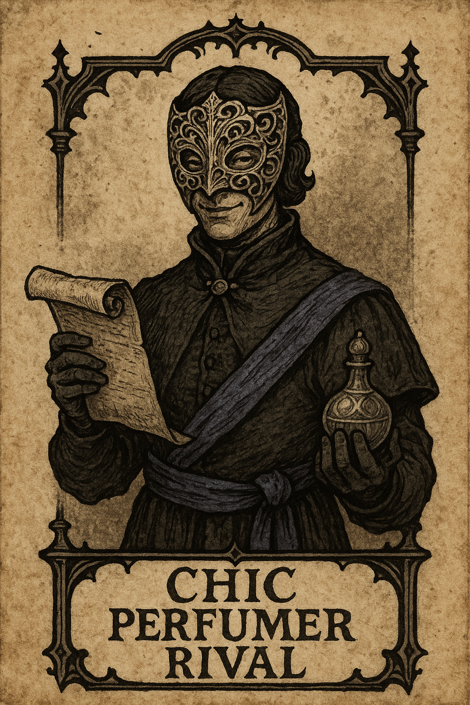
**Role:** Competing perfumer seeking exclusive license; can provide “scent screens”
**Appearance:** Chic mask with silver filigree; sash of blue-violet
**Personality:** Cutting, poised, opportunistic
**Motivation:** Discredit Eau de Morr; secure contracts with Parravon court
**Secret:** Her “screen” uses a trace of Eau de Morr—she stole the technique

### Maître Rolf Steinhauer — Master Mason [S05]
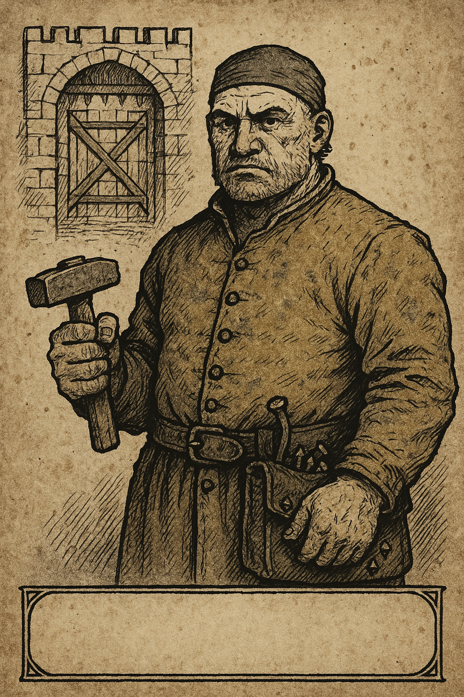
**Role:** Builder wanting the fortress and chapel contracts
**Appearance:** Broad hands, chalk-stained doublet; satchel of iron pins
**Personality:** Gruff, practical, secretly sentimental about old stones
**Motivation:** Rebuild reputation and walls; protect workers
**Secret:** Knows a subsidence under the gate that can be exploited or shored

### Étienne Verdoux — Exchequer Agent [S05]

**Role:** Tax and ownership official; can divert or summon city guards
**Appearance:** Quill behind ear, ledger chain, hawk-scented wax seal
**Personality:** Smiling, exacting, easily offended
**Motivation:** Clarify titles; increase revenue
**Secret:** Holds sealed orders to seize Satanreux assets “in event of scandal”

### Canoness Ysolda — Traditionalist of the Lady [S05]
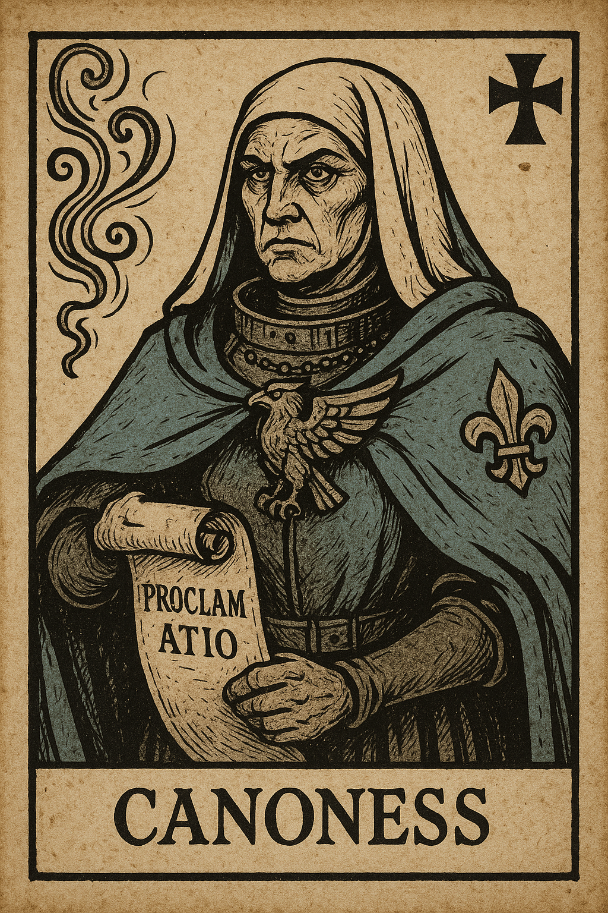
**Role:** Leads zealot cadre; pushes for purge
**Appearance:** Sky-blue mantle, hawk brooch; eyes like drawn steel
**Personality:** Pious, uncompromising
**Motivation:** Purity of shrine and court
**Secret:** Consulted Eléonore once, and fears it might surface

### High Adept of Morr (Name at table) [S05]

**Role:** Senior Morr clergy at the ball; prefers rites over violence
**Appearance:** Black and white vestments; ash-scented gloves
**Personality:** Calm, grave, wry
**Motivation:** Proper endings; minimum scandal
**Secret:** Will accept a pragmatic truce if the dead are honored

Use FTG format for quick reference. Provide stats when needed during prep.

## Robert Le Satanreux II — “Le Deux,” The Burnt Prophet (Undead?) [S05]

- Role: Cursed scion; pivot between redemption and ruin
- Appearance: Half-melted face, pallid skin, scent of herbs and charcoal
- Personality: Wry, fatalistic, oddly courteous; laughs at omens
- Motivation: Prove luck can be mastered, not suffered
- Secret: His reflection hunts him; the coin anchors more than memories

## Eléonore “The Whisperer” [S03]
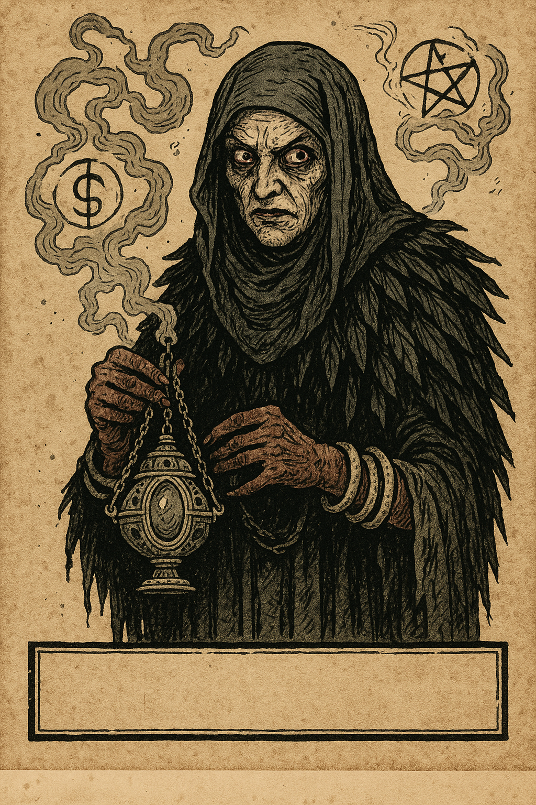
**Role:** Occult perfumer-cult leader; prophetess of the Lady’s “shadow aspect”
**Appearance:** Veiled; raven-feather shawl; bone bangles that clack in iambic rhyme; hands stained with resin and oils
**Personality:** Unhinged zeal, precise ritualist; slips into rhyme; treats omens as answers
**Motivation:** Prove memory can be bottled and luck manufactured through sacrament of scent
**Secrets:** Eau de Morr includes corpse-derived “absolutes”; mirrored censer falsifies omens unless sanctified; heard Robert laughing in a mirror “last week”

## Artois “The Brave” [S02]

- Role: Gambler and accidental lynchpin
- Appearance: Flashy medals, wine-stained smile, perpetually lucky until midnight
- Personality: Charming cowardice; opportunist with a heart
- Motivation: Keep the luck flowing, keep the danger away
- Secret: His “lucky coin” is Robert’s phylactery; ledger is a spellbook

## Margot “The Dowager of Dust” [S04→S05]

- Role: Undead matriarch; courtly terror
- Appearance: Decayed elegance; skeletal servants with perfect etiquette
- Personality: Cutting, nostalgic, exacting host
- Motivation: Preserve the family—dead or alive
- Secret: Bound to the estate by a mis-consecrated chapel; wants a proper waltz

### Skeletal Major-Domo of Malchance [S04]

**Role:** Enforces etiquette and ceremony within Château Malchance; gatekeeper to Margot’s favor
**Appearance:** Polished skull, immaculate tailcoat stitched to bone; silver nameplate worn smooth
**Personality:** Courteous, exacting, faintly amused by the living’s missteps
**Motivation:** Maintain perfect ceremony; see the practice waltz completed properly
**Secret:** Knows the chapel’s vow-lines and will hint at them if addressed with flawless titles

### Perfume Inspector Clairette de Lys [S04]

**Role:** Perfumers’ guild agent at the Parravon Gate; screens travelers for “perfumed corruption”
**Appearance:** Blue sash, hawk-sigil stamp, scent-cones and blotters at her belt
**Personality:** Brisk, professional, enjoys catching fakes
**Motivation:** Keep scandal out of Parravon; earn guild favor for accurate detections
**Secret:** Mildly allergic—hawks sneeze when Eau de Morr is near; she masks it as “a sign”

## Ysabeau “The Perfumed” (Ancestor Spirit) [S03]
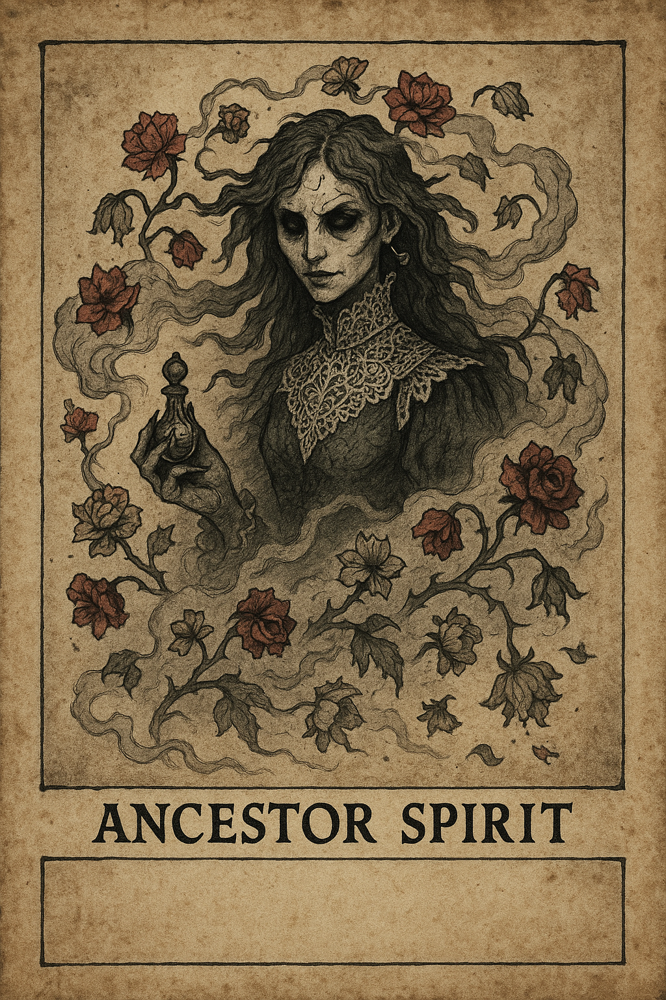
- Role: Perfume-bound spirit; boon or bane
- Appearance: A scent that arrives before the apparition; flowers bloom and wither
- Personality: Coy, cruel, intoxicating
- Motivation: Be remembered through scent and scandal
- Secret: The perfume still is a reliquary; overuse calls something worse

## Corporal Hansi Unteruber [S03]
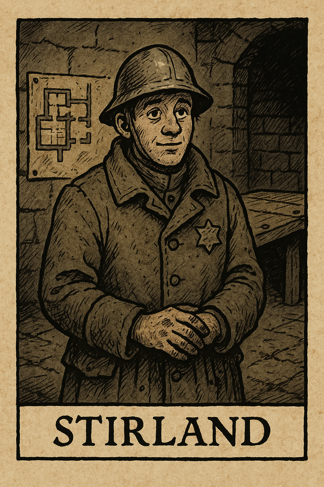
- Role: Stirland militia corporal and eager helper; offers planning help for the barge heist
- Appearance: Too-large corporal’s coat, crooked badge, ink-smudged fingers; faint smell of damp cellar and boiled cabbage
- Personality: Earnest, overeager, proud that “my uncle once helped real adventurers”; craves a chance to be useful
- Motivation: Prove himself by assisting heroes like his uncle did; keep the river quiet without angering anyone important
- Secrets: “Borrowed” river-patrol shift notes and a stencil for guild seals; knows a culvert route to the moorings behind the barge
- Offers: Invites the party to "his" (his mother’s) basement to plan a stealth approach; provides minor hints to Reliquary Extraction (tool lists, timings)

## Luc le Rôdeur (Rumored Bastard) [S04→S05]
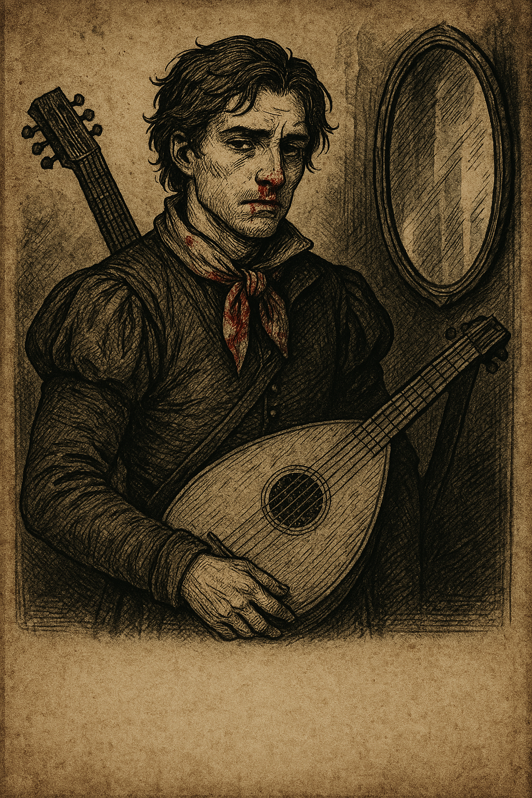
- Role: Nosebleed minstrel; wandering herald of misfortune
- Appearance: Handsome, harried; blood-stained kerchief
- Personality: Romantic fatalist
- Motivation: Find a father or a legend worth singing
- Secret: Songs can open mirrors; he doesn’t know how to stop

## Supporting Cast (Evergreen)
- Parravon Chaplain of the Lady (Traditionalist): smile like a blade; hates foreign meddling
- Guild Taster (Vintners’ Guild): nose insured for a fortune; addicted to bone wine
- Orc Pilgrim Chieftain: reveres the Burnt Prophet; seeks an omen of Waaagh!

<br/>


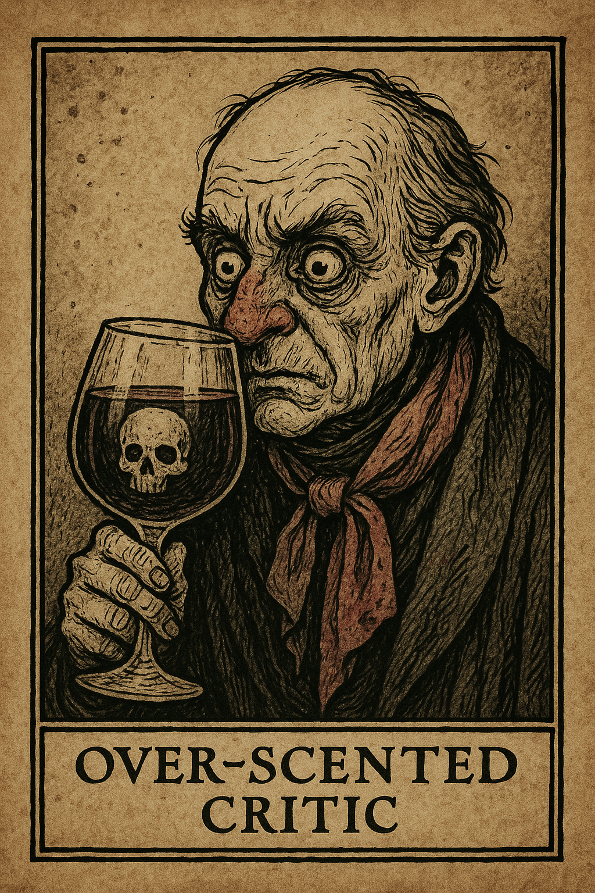
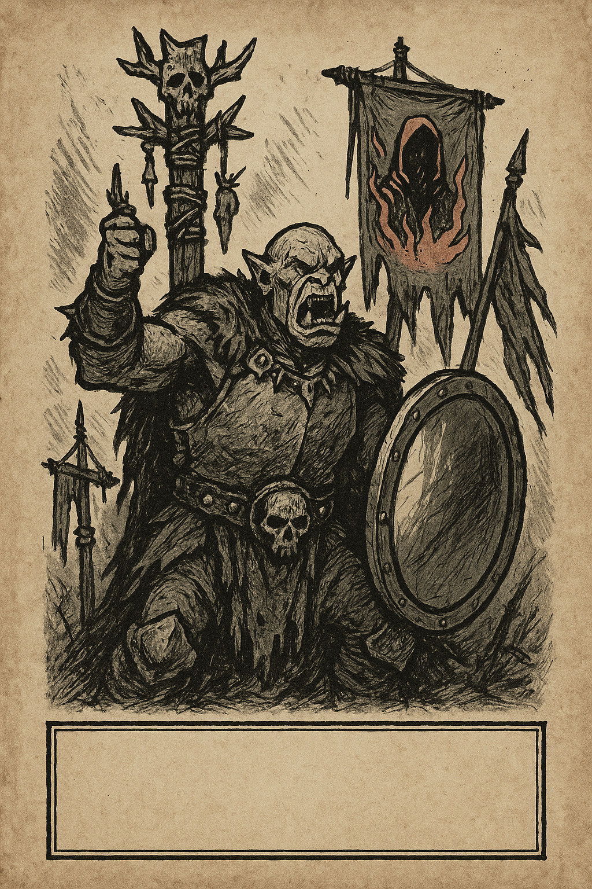

---

## Session 01 NPCs and Recurring Contacts [S01]

### Witch Hunter Captain Hildegard Falk

**Role:** Patron or rival; issues quiet commission and visas
**Appearance:** Severe black coat, silver hammer pin, ink-stained fingers; voice like a quill on parchment
**Personality:** Controlled, pragmatic, unsentimental
**Motivation:** Resolve the scandal without a diplomatic fire; gain leverage on Bretonnian clergy
**Secret:** Keeps a vial of Eau de Morr “as evidence”; it sometimes blooms on her desk

### Mariette Voss — Eléonore’s Procurer
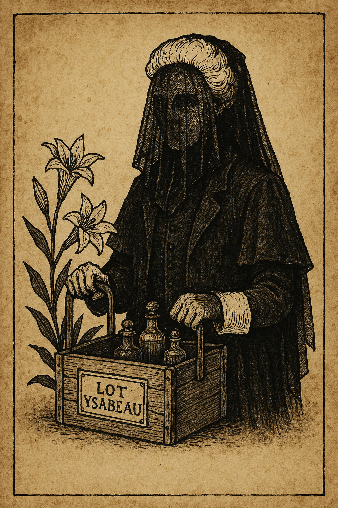
**Role:** Altdorf fixer for Eau de Morr shipments; source of clues to Stir Dock 3
**Appearance:** Powdered hair, mourning veil, ledger-cuffed sleeves; scent of lilies over grave-cold
**Personality:** Courteous, mercantile, superstitious about ravens
**Motivation:** Keep the business profitable and doctrinally defensible
**Secret:** Knows the Lucky Coin must “toll midnight” inside the Golden Pike

### Captain Rémy Valoise — Border Customs (Bretonnia)

**Role:** Controls border passage and stigma; gatekeeper to Parravon
**Appearance:** Immaculate tabard, hawk plume, red-rimmed eyes from incense
**Personality:** Ledger-minded, calm, faintly weary
**Motivation:** Maintain order and favor with court; keep zealots in check
**Secret:** On the vintners’ payroll; hides a cracked pilgrimage mirror

### Abbé Celestin d’Anjou — Traditionalist Chaplain of the Lady
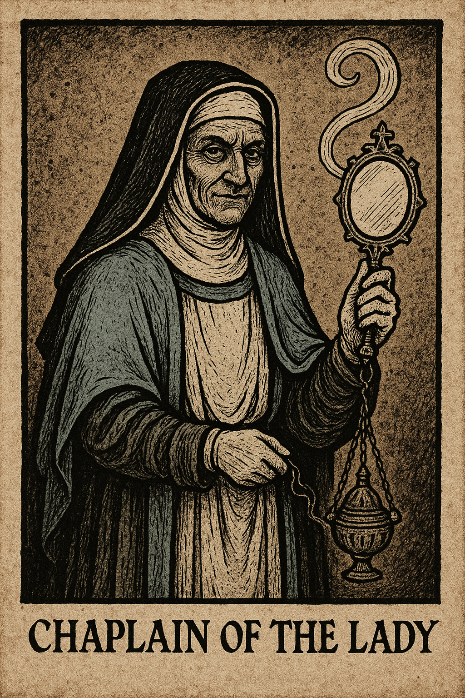
**Role:** Administers purity tests; theological antagonist
**Appearance:** Sky-blue and white vestments; gloves to avoid “polluted” relics
**Personality:** Smiling severity; doctrinaire
**Motivation:** Purge heresy; humiliate Morr’s interlopers; destroy Satanreux anchors
**Secret:** Once consulted Eléonore; his reflection sometimes blinks on delay

### Kaspar “Rotgut” Kessel — Mirror Bandit Leader
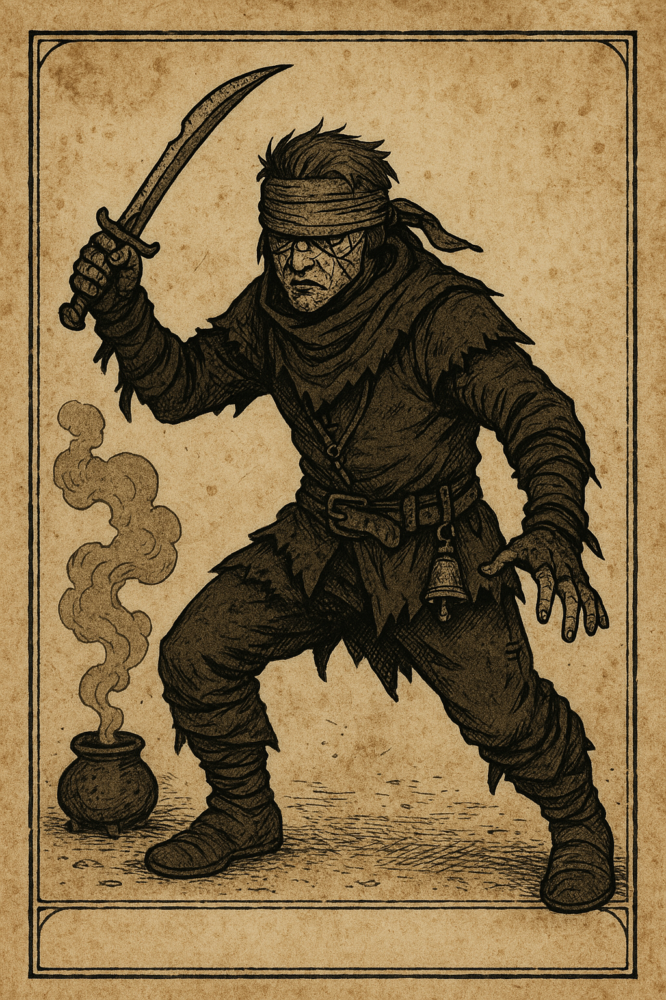
**Role:** Leads ambushes to seize mirrors and mirrored objects
**Appearance:** Scarred cheeks like shattered glass; fights by bell-sound to avoid seeing reflections
**Personality:** Skittish, opportunistic, not bloodthirsty
**Motivation:** Get paid by a “guildman with a falcon pin” (vintners front)
**Secret:** Carries Eau de Morr stopper with falcon crest; map scrap to Stir Dock 3

### Mogdrak Skullgleam — Orc Pilgrim Herald

**Role:** Herald for the Burnt Prophet; can become a noisy escort
**Appearance:** Blackened face paint, polished shield as “seer glass,” bacon-grease incense
**Personality:** Boisterous, reverent in an orcish way
**Motivation:** Find omens that prove “’e lives”
**Secret:** His shield reflection sometimes mouths “Not yet” to one viewer

### The Master Falconer of Parravon

**Role:** Tests foreigners; grants letters for archive access
**Appearance:** Windburned features, hooded hawk on wrist, mirrored buckler
**Personality:** Dry humor, values steadiness and mercy
**Motivation:** Keep fools out of the flooded archives; honor the eyrie’s reputation
**Secret:** Archive ledgers mention mirror repairs billed to “Château M.”

### Guild Taster (Named at Table)

**Role:** Access point into vintners’ guild; sniff out bone wine operations
**Appearance:** Over-scented, red-veined nose, silk scarf stained by tastings
**Personality:** Smug, easily bribed, secretly nervous
**Motivation:** Maintain status and palate; keep bone wine quiet
**Secret:** Addicted to “Reserve” and losing true memories to bouquet

### Morr Priest Contact (Named at Table)

**Role:** Quiet ally; offers sanctification, lore, or absolution tokens
**Appearance:** Black robes, white skull rosary, tired eyes that miss little
**Personality:** Compassionate but blunt
**Motivation:** Set mislaid souls to rest; curb excesses of both courts
**Secret:** Knows the chapel at Château Malchance was mis-consecrated

## Session 03 NPCs and Allies [S03]

### Ferryman of the Stir (Eléonore’s Route)
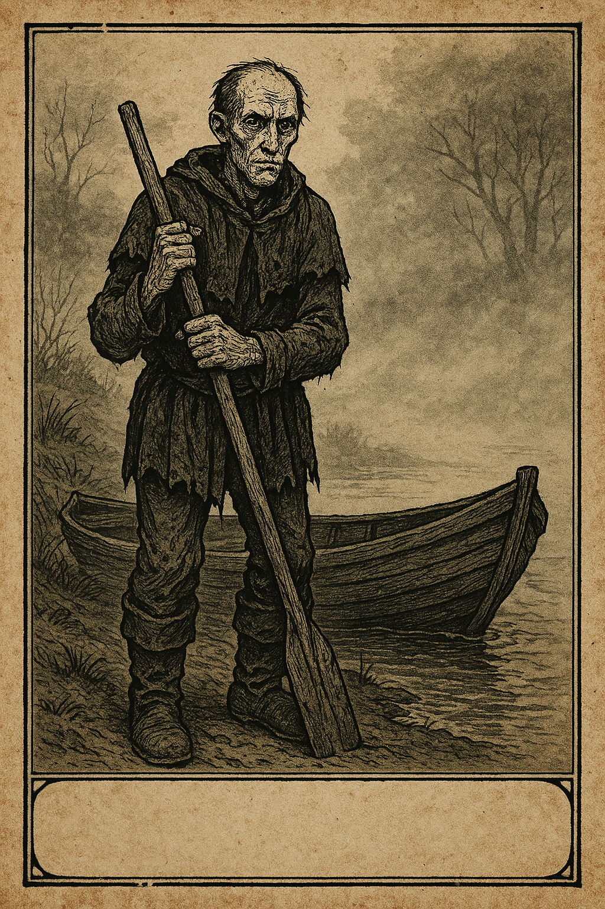
**Role:** Compelled boatman for the bone barge
**Appearance:** Hollow cheeks, oar-scarred hands, river-mud boots
**Personality:** Resigned, whispers to the river when afraid
**Motivation:** Be freed from service; warn travelers subtly
**Secret:** Holds a delivery chit ledger linking Dock 3 to the barge

### Raven-Choir Attendants (2–4)
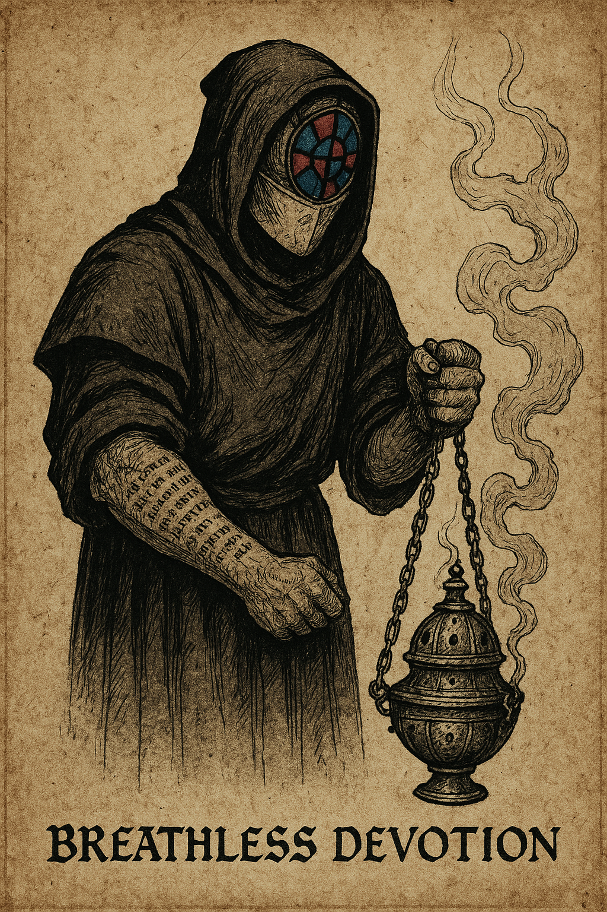
**Role:** Chanting assistants who keep ritual time; enforce etiquette
**Appearance:** Black half-masks lined with saint-glass slivers; inked verses on forearms
**Personality:** Breathless devotion; easily rattled when rites break tempo
**Motivation:** Seek revelations and protection through scent
**Secret:** One stole a vial labeled “Lot Ysabeau”; another fears the censer’s mirror

### Witch Hunter Widow (Golden Pike Regular)

**Role:** Social lever inside the Pike; rumor source about Artois
**Appearance:** Black lace, old badge pinned under shawl, watchful eyes
**Personality:** Bitter wit, sharp memory for faces
**Motivation:** Win enough to stay afloat; shame those who cheat honor
**Secret:** Keeps a key to a Pike side door; owes a favor to Captain Falk

### Dock Boss (Nuln Waterfront)
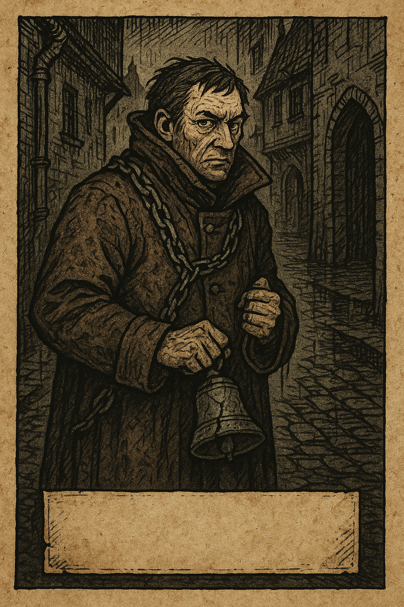
**Role:** Controls Pike-side berths; gatekeeper to back alleys
**Appearance:** Thick coat, ledger chain, bell with cracked clapper
**Personality:** Practical, bribe-friendly, caste-conscious
**Motivation:** Keep the docks moving; avoid Witch Hunter attention
**Secret:** Saw the coin “change sides” at midnight; won’t speak without a marker

---

## Session 02 — Golden Pike Additions [S02]

### “Master of Midnight” — Pit Boss
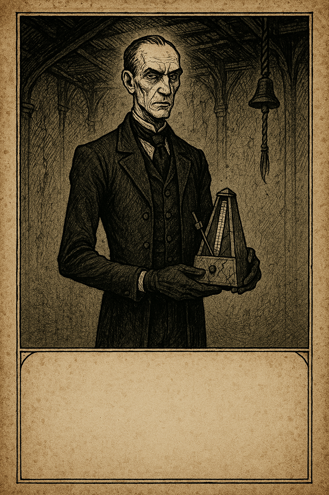
**Role:** Times the games to the bell; controls floor access
**Appearance:** Tall, spare, gloved; carries a cracked metronome
**Personality:** Precise, humorless, surprisingly polite
**Motivation:** Keep the house profitable and unburned
**Secret:** Knows a crawlspace to the bell rope; will sell the route dearly

### Johan Pech — Nervous Accountant

**Role:** House numbers man; luck clings to him in unsettling ways
**Appearance:** Pallid, ink-stained, abacus beads like a rosary
**Personality:** Timid, jumpy, desperate to please
**Motivation:** Survive the midnight shift; balance books that refuse to tally
**Secret:** Knows the ledger’s hiding place; can identify when the “hum” begins

### Signet “Velveteen” Sarto — Bravos’ Captain
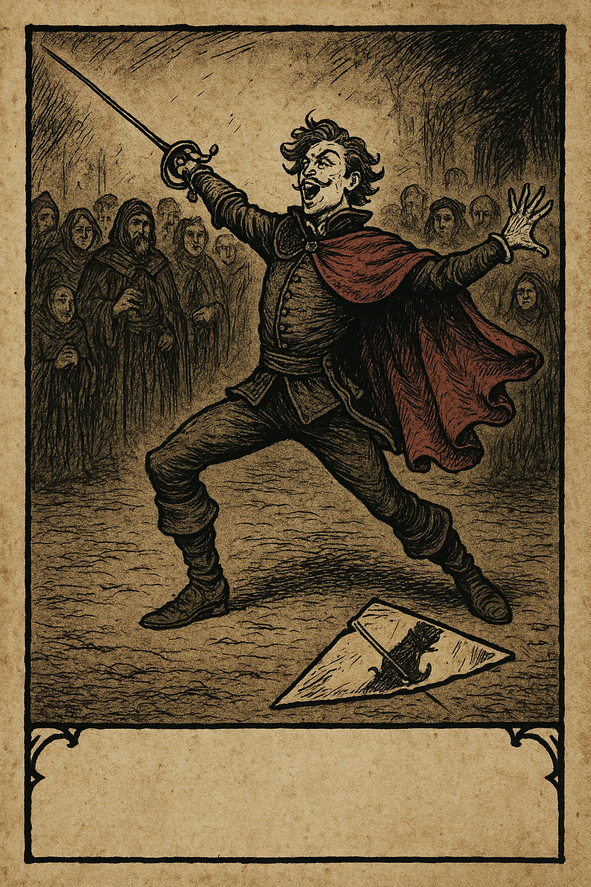
**Role:** Enforces nonlethal duel customs on the Pike’s strip
**Appearance:** Velvet half-cape; scar that resembles a club suit; immaculate boots
**Personality:** Showy, vain, conflict-avoidant under pressure
**Motivation:** Keep blood off the floor and coin on the tables
**Secret:** Afraid of mirrors; will throw a flourish for the right price
