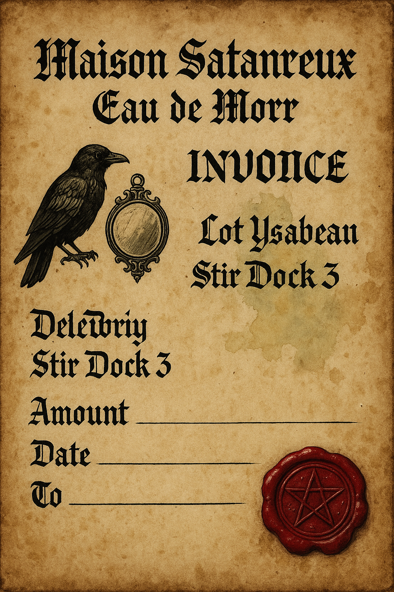

# Session 01 — The Call to Bretonnia

Purpose: Launch the campaign, seed core motifs (coin, perfume, mirrors, “Not yet”), and send the party from the Empire toward Parravon with papers, allies, and a looming sense of cursed inheritance.

Session length: 3–4 hours

Primary beats:
- Hook in Altdorf (or briefing) → investigation and prep → road perils (Empire-side) → Ending up in Nuln.

---

## Deep Background (for the GM)

- House Le Satanreux exported “luck” into the Empire through an apothecary front selling Eau de Morr (a perfume laced with ancestor-scent). Eléonore’s agents believe the Lady has a “shadow aspect” that legitimizes their rites; Morr’s clergy believes errant funerary magic is misdirecting souls toward Château Malchance.
- Traditionalists in Parravon fear scandal and want a quiet purge. Witch Hunters in Altdorf want leverage: shut down the cross-border heresy without igniting a diplomatic incident.
- Orc pilgrims from the Drakwald carry rumors of a Burnt Prophet who laughs at mirrors. They converge on border roads hoping for a sign.

Core truth to reveal gradually: The Satanreux “manufacture” luck by binding it to anchors (coin, perfume still, reliquary/mirrors). Each anchor tugs at Robert Le Satanreux II across death and reflection.

---

## Key NPCs (Session 01 focus)

Use FTG target modifiers as guidance: Very Easy (+60), Easy (+40), Average (+0), Hard (−20), Very Hard (−30).

1) Witch Hunter Captain Hildegard Falk (Patron or Antagonist-in-waiting)
- Appearance: Severe black coat, silver hammer pin, ink-stained fingers; speaks softly, never repeats herself.
- Role: Offers the job and letters of passage if the PCs keep this “quiet.”
- Motivation: End the scandal, gain leverage on Bretonnian clergy, recruit capable deniables.
- Methods: Contracts, conditional absolution, bribes to customs.
- Secrets: Has purchased Eau de Morr “for evidence” and keeps it in her desk; it occasionally blooms.
- Tests: Charm/Intimidate (Average) to secure better terms; Evaluate/Trade (Easy) to spot the slush-fund cover.
- Quote: “A candle is enough to banish darkness—provided it does not perfume the room with corpses.”

2) Mariette Voss (Eléonore’s Procurer in Altdorf)
- Appearance: Powdered hair, mourning veil, ink-stained ledger cuffs; smells faintly of lilies then cold earth.
- Role: Sells Eau de Morr, moves ancestor vials, launders coins.
- Motivation: Keep the business running and her mistress’ doctrine credible.
- Secrets: Knows of a “special coin” that must never reach midnight outside the den in Nuln; fears ravens.
- Tests: Gossip/Charm (Easy) for rumors; Intuition (Average) to catch the flinch at mirrors; Sleight of Hand (Hard) to lift a vial.
- Quote: “Scent is memory. Memory is immortality, in polite company.”

3) Abbé Celestin d’Anjou (Traditionalist Chaplain of the Lady)
- Appearance: White and sky-blue vestments; gloves to avoid touching “polluted” relics.
- Role: Administers purity tests; blocks "shadow aspect" heresies.
- Motivation: Prevent scandal; destroy Satanreux anchors; humiliate Morr’s interlopers.
- Secrets: Once consulted Eléonore in private; fears his reflection blinks on its own.
- Tests: Theology (Morr vs. the Lady) debate via Social Combat; Willpower (Hard) to resist incense-induced visions.
- Quote: “The Lady’s face has no shadow. That is your first mistake.”

4) Kaspar “Rotgut” Kessel (Mirror Bandit Leader)
- Appearance: Scars crossing his cheeks like shattered glass; won’t meet his own eyes.
- Role: Leads an ambush to seize any mirrors or mirrored items from the party.
- Motivation: Get paid by “a guildman with a falcon pin” (Vintners front).
- Secrets: Carries a stopper of Eau de Morr that wilts or revives flowers.
- Tests: Intimidate (Easy) to scatter the mooks; Interrogate (Average) to learn the employer’s clue.
- Quote: “Don’t look! If you see it, it sees you.”

5) Mogdrak Skullgleam (Orc Pilgrim Herald — Cameo)
- Appearance: Blackened face paint; polished shield used as a mirror; bacon-grease incense.
- Role: Delivers omen-seeking antics; can become a noisy escort if appeased.
- Motivation: Find signs that "Da Burnt Prophet" lives.
- Secrets: His shield sometimes shows a human mouth whispering “Not yet.”
- Tests: Command (Average) to keep order; Perform (Average) or Lore (Religion) to stage a “sign.”

---

## Locations (expanded backstories)

1) Altdorf — Maison Satanreux Apothecary (Front)
- History: Once a reputable spice house, purchased cheaply after its owners vanished during a winter plague. Eléonore’s cult retrofitted a cellar into a micro-ossuary still.
- Layout & Atmosphere: Bell over the door chimes out of rhythm; dried bouquets hang from rafters; faint mirror set behind the counter always a half-breath slow.
- Features: Ledger written over an older spell—ink shades different under moonlight; trapdoor to a cool cellar with ribbed shelves of vials; raven roost in the chimney cap.
- Secrets & Clues:
	- Vial stamped with a falcon sigil (Parravon vintners’ guild)—points to court influence.
	- Mirror smudges form the letters N—U— (Nuln) when breathed upon at midnight.
	- Receipt for “perfume glass” ordered to a riverside dock on the Stir (points to Eléonore’s barge).

2) Altdorf — The Candle Vault (Witch Hunter Briefing House)
- History: Safehouse used for quiet operations against cults; candles labeled with case names.
- Atmosphere: Beeswax, iron, and stale parchment; floorboards that don’t creak in certain paths.
- Features: Lockbox with pre-signed letters of passage; a Morr token in a velvet pouch.
- Secrets: One candle is labeled “Satanreux — Third Death.” It refuses to stay extinguished.

4) The Hollow Way (Optional Shortcut)
- History: Old funeral path; tree canopies knit overhead; ravens perch in precise intervals.
- Effect: Cuts half a day but invites omens and reflection anomalies; low-level corruption checks on failed Willpower.
- Sign: A cracked hand-mirror wedged in a stump whispers “Not yet” in a PC’s voice.

---

## Opening Scenes (choose one or blend)

1) Apothecary Incident (Investigation + Social)
- Event: A well-heeled buyer samples Eau de Morr, goes glassy-eyed, and whispers “Not yet.”
- Beats:
	- Calm the crowd (Leadership/Charm, Average).
	- Inspect the vial (Lore: Magic or Medicine, Average → learn “ancestor-scent”).
	- Spot the ledger overlay (Perception, Easy → find Stir dock order; follow-up Inquiry, Average).
	- Mariette bargains: aid her shipment in return for information; she hints of a “midnight coin.”

2) Witch Hunter Briefing (Social)
- Offer: Letters of passage, minor absolution, expense purse.
- Conditions: Keep it quiet; return anchors for evidence or provide proof of destruction.
- Complication: Another cell wants a public purge; they may become rivals later.

3) The Street Whisper (Quick Hook)
- A raven drops an invitation scrap: “Celebrate Robert’s third death.” Address smudged with wine.
- Leads to either the Apothecary or Brücke-Watch (see Session 03) depending on player choice.

---

## Road Perils (run 1–2)

1) Mirror Bandits (Combat/Intimidation)
- Goal: Steal mirrors or mirrored objects.
- Tactics: Smoke pots; do not look into reflective surfaces.
- Clues on Capture: Coin rumor; Eau de Morr stopper with falcon crest.

2) Green Pilgrimage Cameo (Fun Social)
- See encounters.md (“The Green Pilgrimage”). Use if players need a hopeful omen or loud escort.

3) Beastmen Spore (Atmospheric)
- No fight unless provoked; ravens peck tracks into the shape of a tear.

---

## Clue Trail (what Session 01 should deliver)

- Coin Motif → Nuln den at midnight (Artois).
- Perfume Motif → Stir dock orders (Eléonore’s barge).
- Mirror Motif → Brücke-Watch tests and delayed reflections (Session 03; Château Malchance).
- Raven/“Not yet” Motif → Robert’s continued influence; Orc pilgrims seeking signs.

---

## Outcomes & Branches

- Best Case: Ally in Falk, solid clues to coin and barge. Reputation: +1 with pragmatic officials, 0 with Traditionalists.
- Mixed Case: Forged papers work but flag PCs (Heat +1). Gain a rival in the zealot faction. Orcs might trail you as “heralds.”
- Worst Case: Mirror bandits escalate or a rite goes awry; take the Hollow Way (gain 1 temporary Corruption if you fail a Hard Willpower test) but reach Nuln with spooky proof that “something watches.”
- Optional: If PCs steal the wrong mirror, the reflection pursues one character in dreams (advantage once / penalty once next session; GM’s choice depending on play).

---

## Rewards

- Letters of Passage (advantage on future customs checks once).
- Token of Morr (once per session reroll vs. fear/corruption).
- Favor from Falk (banked; spend to cancel one bureaucratic obstacle later).
- If allied with Orcs: Orc Token (advantage on tests to influence Orcs; disadvantage with stuffy nobles if displayed).

---

## Handouts & Props (optional)

  
	
- Invitation Scrap: “Celebrate Robert’s third death — dress to reflect.”
  
	

  

## GM Notes & Pacing

- Spotlight balance: Give each PC a scene to use their best approach (face for customs, scout for Hollow Way, scholar for perfume/mirror lore).
- Fail Forward: Even failed checks produce clues at a cost (heat, stigma, minor corruption, a rival).
- Tone: Grim but not hopeless; let odd humor breathe through Orc pilgrims and bureaucratic absurdity.

---

## Next: Session 02 — The Lucky Midnight (Nuln)
- Pursue Artois and the midnight coin; choose to seize, sanctify, or let the luck ride.
