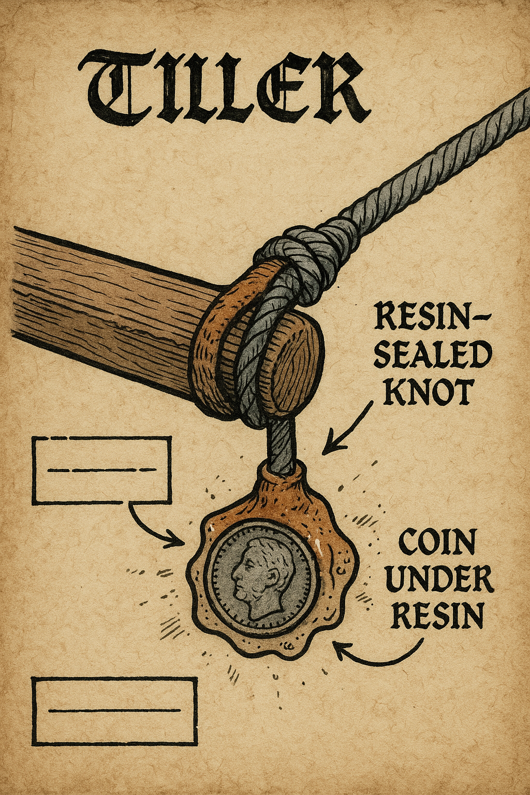

# Session 03 — Perfumes and Prophecies (River Stir)

Purpose: Confront Eléonore the Whisperer on her bone-barge, expose her corpse-derived “Eau de Morr,” and decide the fate of the portable perfume still (anchor). This session should feel eerie, devotional, and unsettling.

Session length: 3–4 hours

Primary beats:
- Fog approach → doctrine debate → lab investigation → rite interruption or bargain → choice about the still and the ferryman → river chase or quiet departure.

---

## Deep Background (for the GM)

- Eléonore is an unhinged, zealously devoted cult leader who believes the Lady has a “shadow aspect” that sanctifies what the living refuse to admit: that love, memory, and “luck” can be extracted from the dead. Her Eau de Morr is distilled by macerating funerary oils, bone dust, and shavings of saint-glass with a secret “absolute” rendered from harvested corpse-tallow. The process is performed as a rite, guided by a mirrored censer that “aligns” reflections of the soul.
- Morr notices her work, which is why omens on the barge feel real—she is dangerously wrong for convincing reasons. The portable still doubles as a reliquary; its copper is etched with family names, and it resonates with House Satanreux anchors.
- The ferryman is press-ganged into service via a binding coin sealed in tree resin under the tiller. If freed, he can carry the PCs upriver discreetly toward Parravon.

Core truth to reveal: The still is an anchor binding scent to memory via corpse extracts; destroying, sanctifying, or claiming it meaningfully alters how “luck” manifests later (grand ball).

---

## Key NPCs (Session 03 focus)

1) Eléonore “The Whisperer”
- Role: Antagonist-or-ally of conviction; occult perfumer and doctrinal firebrand
- Portrayal: Unstable zeal balanced by precise ritual practice; voice slips into meter; hears “answers” from ravens and reflected smoke
- Motivation: Prove the Lady’s shadow aspect is true by making memory tangible; protect her reliquary still
- Secrets: Eau de Morr includes corpse-derived absolutes; the mirrored censer falsifies omens unless sanctified; Robert’s laughter echoed in her mirrors “last week”

2) The Ferryman (Bound Guide)
- Role: Reluctant helper; witness to Eléonore’s rites
- Motivation: Be released from service; avoid zealots on either side
- Secrets: Knows where the binding coin is hidden; can steer to quiet coves if freed

3) Raven-Choir Attendants (2–4)
- Role: Chanting assistants who keep time for rites
- Motivation: Earn revelations and protection; many are addicted to the scent
- Secrets: Their masks are lined with saint-glass slivers; one has stolen a vial labeled “Lot Ysabeau”

4) Corporal Hansi Unteruber (Basement Planner)
- Role: Stirland militia corporal who admires adventurers; offers planning aid
- Motivation: Live up to his uncle’s stories by helping “proper heroes” do a clean job
- Secrets: Keeps patrol shift notes and a crude map of culverts; mother disapproves of “those sorts” visiting
- Aid: Grants advantage (+10) to the first Stealth/Mechanics test during Reliquary Extraction if the Basement Briefing is completed

---

## Locations (Barge Interior)

1) Deck Chapel
- Atmosphere: Fog-lanterns; raven perches; mirrored censer trailing perfumed smoke
- Mechanics: If censer is intact, omens tilt toward Eléonore’s doctrine (−10 to opposing Theology tests)

2) Extraction Lab
- Atmosphere: Copper still humming; racks of bones; vials labeled with lot names (Lot Ysabeau, Lot Dowager, Lot Lucien)
- Mechanics: Investigation (Average) identifies corpse-derived components; Lore (Religion/Magic) (Hard) reveals reliquary etchings as anchor runes

3) Tiller and Tithe
- Atmosphere: Quiet stern; resin-sealed knot under the tiller
- Mechanics: Spot/Trade (Hard) to find the resin coin; breaking it frees the ferryman from service

---

## Opening (choose or chain)

1) Fog Approach
- Skiff or riverside ambush; Eléonore invites “witnesses” to a sermon if PCs act with courtesy

2) Perfume Run Continuation
- Follow the Dock 3 chit from earlier; Mariette’s crate sits ready to be “blessed” into Eau de Morr

3) Basement Briefing (with Corporal Hansi)
- Hansi ushers the party into his mother’s basement. On an old door laid flat as a table, he sketches patrol routes, culverts, and the barge’s usual tie points. Gain a Planning Boon: +10 to one heist roll (Stealth/Mechanics) and a paper “guild seal” that might pass quick scrutiny.

---

## Social Combat — Doctrine vs. Rite

Frame a formal debate in three exchanges (best of three wins). Use FTG Social Combat with these levers:

- Arguments for Morr (PCs): sanctity of rest; danger of binding luck; consent of the dead
- Eléonore’s Counters: memory as sacrament; the living waste miracles; proof-by-omen (raven, smoke, mirror)

Tactics & Modifiers:
- Sanctify the censer first (Lore: Religion + Willpower, Hard) to remove her −10 doctrine edge
- Use evidence from the Extraction Lab for +10 on one exchange
- Invoke a personal memory (roleplay) to force Eléonore’s Cool test; on failure she lapses into rhyme and loses a die of influence

Outcome of Debate:
- PCs Win: Eléonore is shaken; she will bargain; her attendants falter
- Mixed: She demands a proof (interrupting rite) or a sacrifice (vial, favor)
- PCs Lose: She proceeds with a grand anointing—risking a minor miscast-like effect on everyone present

---

## Optional Location — Brücke-Watch Waystation (Border)

- History: Built where an old mirror-stone once stood; customs expanded around it; a shrine to the Lady faces a small, neglected stone of Morr.
- Atmosphere: Incense smoke; the sound of falcons; ledger scratching; pilgrims queued for purity tests.
- Features: Reliquary with tiny mirrors for “reflection of true self”; stamped wax for visas; holding room draped in blue.
- Secrets & Clues:
	- The official mirror shows a delayed blink to anyone tied to the Satanreux curse.
	- A confiscated coin keeps landing heads at the stroke of each hour.
	- A guard’s livery smells faintly of lilies and grave-mud.

Use this site if the party is routed back through formal customs during Session 03 (or if they return to confront the Traditionalists). It pairs naturally with Social Combat (Doctrine vs. Rite) and with mirror/coin motifs discovered on the barge.

---

## Confrontation Paths (choose 1–2)

1) Interrupt the Rite (Risky)
- Break the mirrored censer (Combat/Called Shot or Sleight) → silent smoke; omens stop; ravens go quiet
- Consequence: Panic among attendants; Eléonore flies into ritual fury (nonlethal duel + corruption risk)

2) Reliquary Heist (Stealth/Skill)
- During chanting, slip the still’s reliquary core free (Mechanics/Trade, Hard)
- Reward: Reliquary Core (token used to downgrade anchor effects later)
 - Planning Boon: If you completed the Basement Briefing, choose either to reduce the difficulty by one step OR to reroll a single failed pick/loosen attempt

3) Sanctify the Deck (Ritual)
- Consecrate the deck to Morr; costs incense/holy symbol and Willpower tests
- Result: Eau de Morr loses its bite; still ceases to function as anchor until repaired

4) Bargain of Scent (Deal with the Devil)
- Turn the still toward a “safer” use: grief-counsel, funerary truth-telling
- Result: Gain Eléonore as an uneasy ally; Traditionalists will hate it; Morr priests will be split

---

## Optional Set Piece — River Chase

If things go loud, the barge casts off:
- Obstacles: Floating logs; fog banks; hostile archers on shore; raven swarms
- Checks: Pilot (Row/Sail), Perception, Ranged covering fire
- Twist: The tiller coin vibrates toward the nearest anchor (hinting at Château Malchance)

---

## Outcomes & Branches

- Claim the Still (Anchor): You now carry a volatile anchor. Boon: once/session you may force a “memory reveal” in a scene. Cost: risk 1 Corruption and omen backlash.
- Sanctify the Still: Breaks the local anchor effect; gain favor with Morr clergy; Eléonore becomes a prophetic nemesis.
- Destroy the Still: Violent end; raven swarm disperses; House Satanreux omens weaken until the grand ball rebinds them.
- Bargain: Keep the still in controlled use; gain cryptic blessing that helps in Session 05 social phases; risk Traditionalist heat.
- Free the Ferryman: Gain quiet river passage and a loyal guide; unlocks a shortcut to Parravon and a safe cove.

---

## Revelations

- Eau de Morr is corpse-derived; the “absolute” is rendered from tallow and bone shavings
- The still is etched with Satanreux lineage and acts as an anchor
- Robert’s laughter was heard in a mirror last week; he is near moving water

---

## Rewards

- Reliquary Core (token): single-use downgrade to an anchor effect
- Vial of “Lot Ysabeau”: revive a flower/corpse for one sentence; risk 1 Corruption
- Ferryman’s Passage: advantage on travel checks along the Stir to Parravon
 - Hansi’s Patrol Schedule (handout): spend to negate one random patrol complication during the heist or chase

---

## Handouts & Props (optional)

  
	
- Sermon Sheet: A meter of rhyme praising “shadow grace” with mirror sigils

  
	

## Next: Session 04 — Château Malchance (Parravon)
- With the coin/lot/ally in hand, the party approaches the Dowager and the mis-consecrated chapel.
