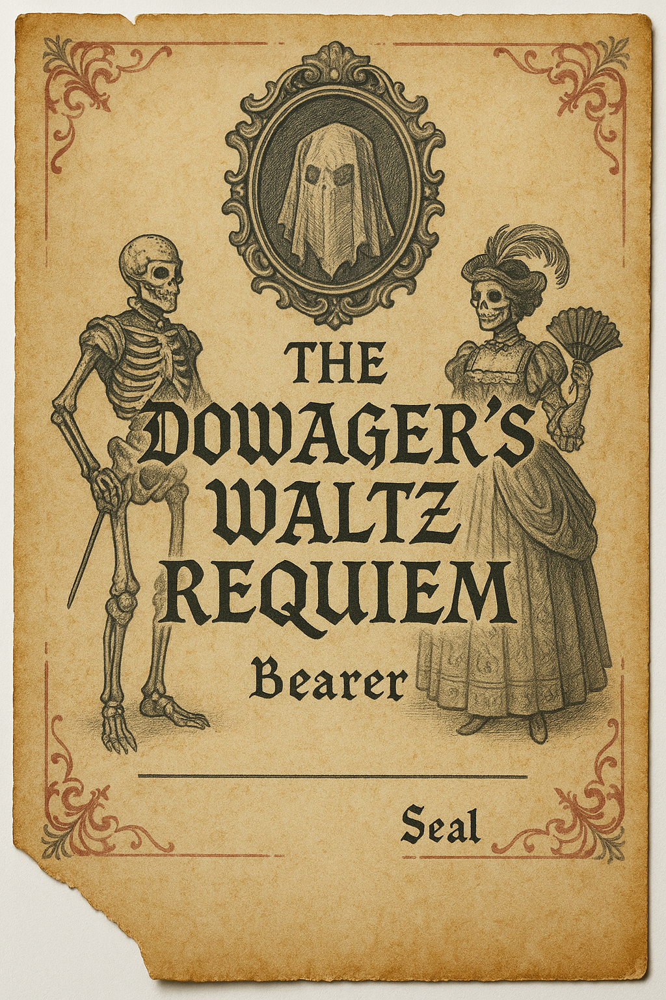
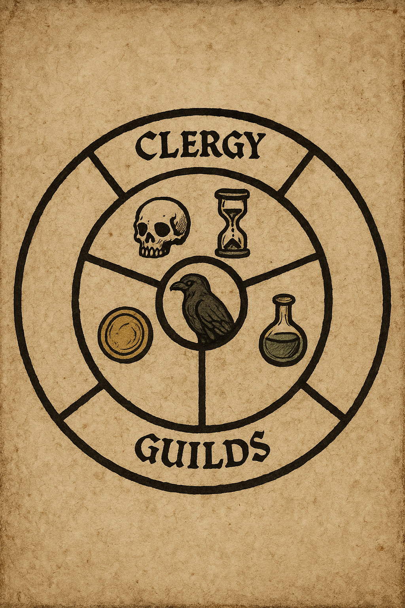
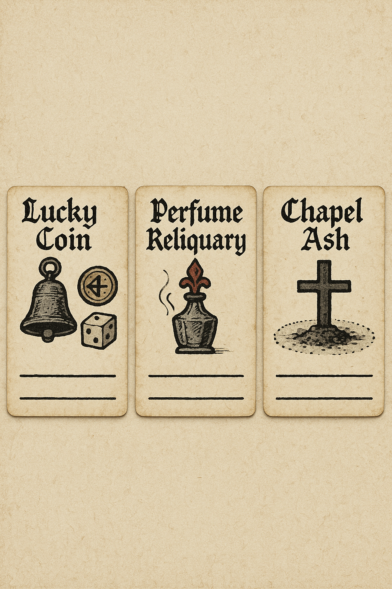
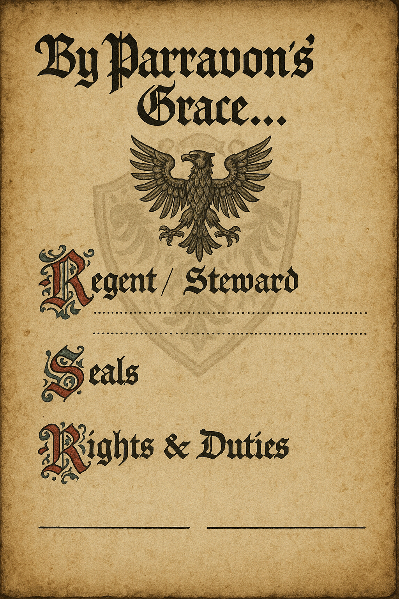
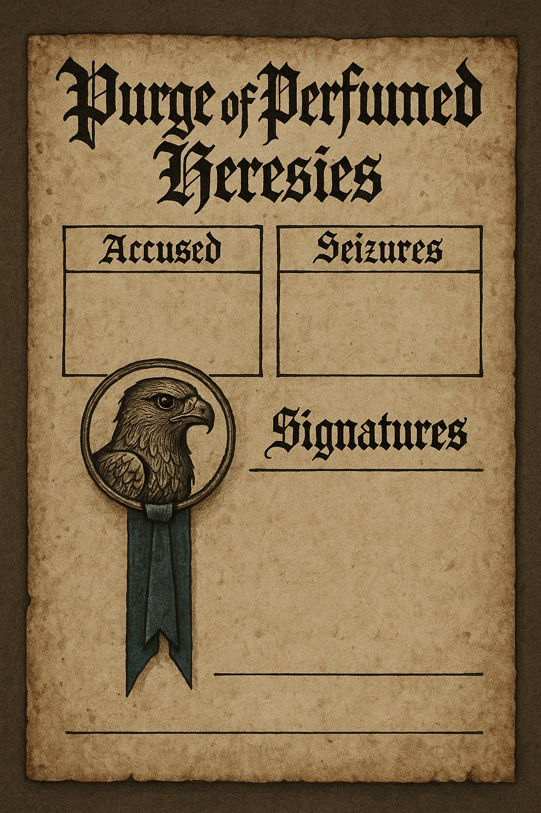
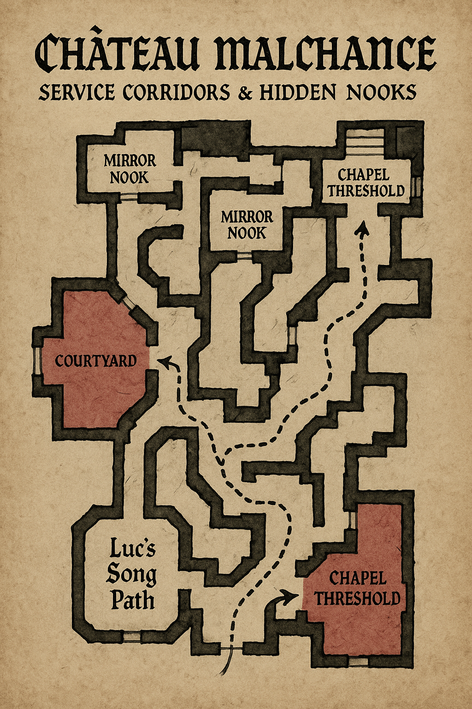

# Session 05 — The Dowager’s Waltz Requiem (Mirror Duel Edition)

Purpose: A clear, single spine finale. Perform the Waltz of Three Deaths to draw Robert “Le Deux” fully from the mirrors, duel him across shattering reflections, and choose to bind, release, or weaponize the Satanreux luck.

Session length: 3–4 hours

Plays differently based on Session 04 outcome:
- If Margot laid to rest: Ballroom calmer; skeletal etiquette‑enforcers are absent; zealots bolder.
- If Margot bargained as ally: One free Waltz assist; skeletal ushers can pin a reflection for a round.
- If Margot empowered: House boons; reflections stronger; nobles nervous; higher chance The Shatter overlays the duel.

---

## Opening — The Masquerade Teeters (Pressure, not focus)

- Scene: A spectral‑meets‑mortal masquerade. The real threat tonight isn’t the crowd—it’s the thing in the glass. Orc pilgrims drum outside; Traditionalist zealots sermonize in corners.
- Three pressure clocks exist but stay in the background unless the party stalls or misplays:
  1) Orc Siege (0–3): 0 = campfire songs; 3 = breach and courtyard chaos.
  2) Zealot Purge (0–3): 0 = whispers; 3 = seizure of anchors.
  3) Reflection (0–3): The only clock that directly gates the duel. At 3, The Shatter begins and the duel is overlaid with adds.
- Advance a pressure clock when the table fails loudly, burns time, or leans on anchors recklessly. Reflection advances on mirror missteps; the others advance on overt social failure or needless delay.

GM cue: Keep spotlight on the Waltz → Duel pipeline. Use Orcs/Zealots to add color, stakes, and consequences—not to steal the scene.

---

## Structure — From Waltz to Duel

1) The Waltz of Three Deaths (Teach the tools)
- Goal: Complete three dance “figures” (in any order) to earn duel boons and unlock the mirror arena.
- Figures and Boons:
  - Echo Timing (Hergig Burn): Bank 1 Echo Token. Spend to act “between ticks,” canceling an enemy readied strike.
  - Mirror Swap (Mirror War): Once, swap places with a willing ally or a reflection within 10 paces and re‑assign a hit.
  - Burn‑Purge (Third Death): Once, ignite an anchor’s memory to purge a reflection’s advantage or strip a defense from Robert.
- Perfect Waltz: If all three figures succeed without a miss, gain a Vow‑Token—command skeletal servants once or auto‑pass one etiquette/taunt line during the duel.

2) Call Him Out (Meeting Le Deux)
- He speaks from glass edges, then steps out of an angle as reflections soften. Offer him a choice you mean: “Face us here, or we break your anchors.” He smirks and accepts.
- Stakes declaration: PCs choose in advance which ending they’re angling for (Bind, Release, Weaponize). This sets the cost they’ll be offered later and foreshadows epilogue.

3) The Mirror Duel (3 Phases)
- Arena: The ballroom refolds as a mirrored gallery; chandeliers double; music thins to a ticking waltz.
- Phases:
  - Phase I — Read the Steps: He tests etiquette. Each round, he reveals a pattern that can be answered by a Waltz boon (Echo, Swap, Burn‑Purge). Using the right boon imposes Disadvantage on his next attack or strips a defense.
  - Phase II — Crack the Pane: He splits into two reflections (one “high contrast,” one “soft”). Correctly identifying and striking the hard‑light version deals real progress; hitting the soft‑light version raises Reflection by 1.
  - Phase III — Ring the Coin: Mirrors fracture; invoke an anchor and make the decisive move: bind, release, or weaponize. See Anchors below for effects.
- The Shatter Overlay: If Reflection hits 3 at any point, 1d3 lesser reflections enter each round; chandeliers drop; ground becomes hazardous. Keep the duel flowing—adds are speed bumps, not a new fight.

4) The Choice (Resolution)
- Bind: Ring the Lucky Coin on a shattered mirror; speak the vow; Robert is bound to ward the Hollow. Luck stabilizes but demands tithe.
- Release: Strike the mirror with chapel ash; invite Morr’s peace; Robert steps into the dark. Luck fades, curse abates.
- Weaponize: Pour the still’s perfume across the pane; pull him into service. Luck grows sharp; so does corruption.

---

## Mechanics — Anchors in the Duel

- Lucky Coin
  - Use: When rung against a mirror, cancel a reflection crit for all allies this round. In Phase III, it enables a clean Bind.
- Perfume Still / Reliquary Core
  - Use: Spend to force a “memory reveal,” exposing Robert to a called shot this round; raises Reflection by 1. In Phase III, it enables Weaponize.
- Chapel Reliquary Ash
  - Use: Sanctify a 10‑pace circle for 1 scene; reflections entering suffer Disadvantage. In Phase III, it enables Release.

Clock guidance:
- Reflection +1 on: missed Waltz figure; striking the soft‑light copy; misusing perfume; smashing random mirrors.
- Purge +1 on: insulting clergy, public anchor theatrics without rite, failing a social defuse.
- Siege +1 on: stalling multiple scenes, refusing envoys rudely, losing the gate bet.

During The Shatter:
- Each round, choose: focus the Duel (drive Phase III), clear adds (1–2 reflections), or stabilize a clock source (gate, zealots) via a single quick scene beat.

---

## Focused Guest Boons (pick 3–4 to feature)

- Canoness Ysolda — Traditionalist
  - Boon: If publicly appeased (repentance words or a chapel pledge), she stays her zealots (Purge −1 once).
- Morr Adept — High Rites
  - Boon: Lends ash for a stronger Release; once per duel, turn a reflection hit into a “warning cut.”
- Colette Vervain — Perfumer Rival
  - Boon: “Scent screen” masks one ally from reflections for a scene; enables a safer Weaponize.
- Rolf Steinhauer — Master Mason
  - Boon: Braces chandelier rigs; when The Shatter hits, you can drop one safely on Robert (stun).
- Étienne Verdoux — Exchequer Agent
  - Boon/Threat: Backdated writs buy you one stall (any clock −1) or, if spurned, he calls city guard away (Siege +1).

Use only those that matter to your table; others remain colorful background.

---

## Simplified Play Loop (at the table)

1) Teach the Waltz figures quickly; give tokens for each success (Echo, Swap, Burn‑Purge; optional Vow).
2) Declare stakes (Bind/Release/Weaponize) in fiction; foreshadow cost.
3) Run 3 duel phases, spending the tokens to answer his patterns.
4) If Reflection hits 3, overlay adds but keep pushing to the Phase III choice.
5) Make the anchor strike; read the outcome.

Fail‑forwards:
- Miss a figure? Reflection +1, but grant a lesser version of its boon.
- Lose Phase II ID once? He lands a showy wound, but reveals his “tell” for future identification.
- Drop to 0 in the duel? An ally can cash the Vow‑Token to keep you on your feet for one last step.

---

## Outcomes (mapped tightly to the choice)

- Redemption (Release)
  - Effect: Chapel sanctified; luck eases; Orcs accept an omen; Traditionalists are mollified; reflections thin in epilogue.
- Masked Regent (Bind)
  - Effect: Robert becomes Warden of the Hollow; uncanny prosperity follows; a PC is marked by the Wardens.
- Damnation (Weaponize)
  - Effect: Potent luck; political enemies multiply; Orcs proclaim you favored; corruption risks increase.

If clocks exploded before the strike: the outcome still stands, but epilogue heat is higher (note: lingering Siege or Purge fallout).

---

## Rewards

- House Writ (political boon): advantage with Parravon bureaucracy for one arc.
- Scent Screen (Colette): negate one detection by reflection or zealot in epilogue scenes.
- Mason’s Bond: call on Rolf’s crew once to fortify or demolish a structure.
- Exchequer Mark: reduce one “Heat” with officials when taxes are concerned.

---

## Handouts & Props (use during play)

- Grand Ball Masquerade Invitation
  
  

- Ballroom Social Rings / Seating Card (to teach the Waltz placements)
  
  

- Anchor Quick‑Ref Cards (Echo, Swap, Burn‑Purge reminders)
  
  

- House Writ / Masked Regency Proclamation (only if you lean Bind/Regent)
  
  

- Zealot Purge Proclamation (if Purge pressure matters)
  
  

- Evacuation / Service Corridors Map (only if The Shatter gets out of hand)
  
  

---

## Epilogue Hooks

- Orc pilgrims seek a new shrine—or trail you for omens.
- Wardens of the Hollow mark a PC without a reflection.
- A minstrel’s song causes polite nosebleeds across Parravon.
- A sealed letter from Bretonnian court arrives: “About your new responsibilities…”
